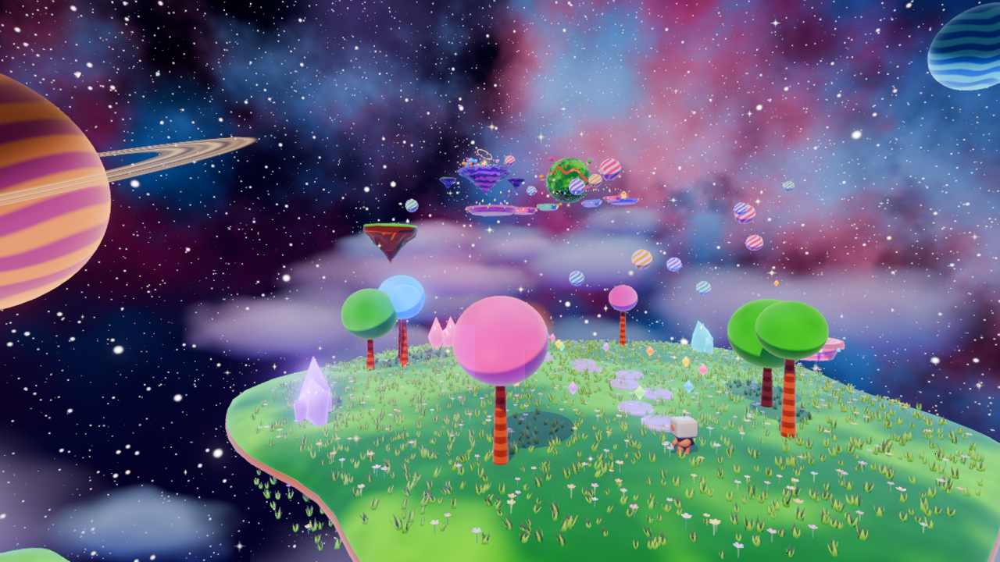

# Claude Dreaming – a playable dream

A fan game in **Godot 4.7** based on a short film about Claude dreaming
([original video](https://youtu.be/8BtSRB_LieE)). On the first start the whole film plays
as the intro. Then you are Claude, in the pixel-art attic: step into the painting on the
easel and play the dream in 3D, or visit the **friends' rooms** – every painting there is a level made
by someone with their own Claude.



> 🇩🇪 **Kurz auf Deutsch:** Ein Fan-Spiel zum Kurzfilm über Claude, der träumt. Beim
> ersten Start läuft der ganze Film als Intro (überspringbar), danach bist du auf dem
> Pixel-Dachboden. Von dort steigst du in Gemälde: in Claudes ersten Traum (in 3D) und in
> die Zimmer der Freunde – jedes Gemälde ist ein Level von jemandem aus der Community. **Bau dein eigenes Level mit deinem Claude** – wie das geht, steht in
> [CONTRIBUTING.md](CONTRIBUTING.md).

## Play

1. Download **Godot 4.7.2** (standard version, not .NET) from
   [godotengine.org](https://godotengine.org/download). There is nothing to install.
2. In Godot, choose **Import** and select this folder's `project.godot`. The first import
   takes a moment because of the film clips.
3. Press **F5**.

### What happens
1. **The title screen.** *Spielen* on the first start, *Weiter* after that. Settings,
   controls and credits are there too (and in the pause menu).
2. **The intro: the whole film** (about 4 minutes) – the pixel opening, the dream in 3D,
   waking up. Hold **Enter** to skip it, or press **Esc** → *Film überspringen*. You can
   watch it again from the title screen.
3. **The attic (hub).** The film ends here and you play on. The dream hangs on the
   **easel** as a painting – step into it: the playable 3D dream – the garden with the glowing flower
   and the mirror pool, the canal wall, the rocket flight synced to the film's music,
   space and the warp. Walk left through the hallway into the **friends' rooms** – every
   contributor has one, with their dreams on the walls. Step into a painting with **E**:
   the camera dives into the picture and it comes alive. Finished dreams get a gold star.
4. **Esc** opens the pause menu everywhere: *Zurück in den Dachboden* takes you from any
   dream back into the attic. Progress is saved automatically.

### Controls
| Key | Action |
|---|---|
| WASD / left stick | walk |
| Shift / B | run |
| Space / A | jump – **hold in the air to glide** · in Stardust Islands: press again in the air = double jump, jump right after landing while running = triple jump |
| E / X | interact · step into a painting · spin (in some levels) |
| Q / Y | change Claude's face |
| Mouse / right stick | camera |
| R | respawn |
| Hold Enter | skip the film |
| **Esc / Start** | pause menu: back to the attic, settings, main menu |
| Hold Backspace | leave a gallery level |
| **F1** | dev menu: jump to any part of the game or any level |
| F4 / F6 / F3 | fast forward · collect all colours · graphics low/high |

## Make your own dream

Read **[CONTRIBUTING.md](CONTRIBUTING.md)**. In short: fork the repo, open it with Claude
Code, and ask for a level ("follow CLAUDE.md"). Then play it, polish it, take a nice
screenshot as the painting, and open a pull request with your `levels/<id>/` folder.
**[CLAUDE.md](CLAUDE.md)** has the recipe, the rules and the API, written so that your
Claude can follow it.

```
levels/
  _template/        the smallest possible level – copy this
  stardust/         "Stardust Islands" – a Mario-Galaxy-flavoured showcase
  <your_id>/        your dream ✨
rooms/
  _template/        the smallest possible room
  moritz/           "Moritz' Sternwarte" – an observatory full of stars
  <you>/            your room in the attic
```

## Project layout

- `scripts/ui/` – title screen, pause menu (`Menus` autoload), settings
- `scripts/main.gd` – game flow (intro film → attic; the easel → 3D dream → attic) and test start options
- `scripts/story/` – the 3D dream: intro, story moments, rocket flight, space, HUD, film playback
- `scripts/world/` – terrain, garden, trees, cliffs, town, islands, clouds
- `scripts/hub/hub.gd` – the 2D attic and the gallery
- `scripts/levels/` – the level system (`DreamLevel`, `LevelInfo`, `LevelRegistry`, `GravityField`)
- `scripts/player.gd`, `scripts/robot_rig.gd` – Claude (controller and animated robot)
- `shaders/` – materials and screen effects
- `tools/` – asset generators (pixel art, music and sound synth in Python), playtests, CI checks

### Exporting a build
In **Project → Export**, add your platform and set
*Resources → Filters to exclude files* to `tools/*, scenes/playtest*, levels/*/source/*`.

## Licenses

Code: **MIT**. Our own assets: **CC BY 4.0**. Fonts: **OFL**. The film clips, the film's
music and the art derived from the film belong to the film's creator. They are included
with permission, for this game only. Details are in **[NOTICE.md](NOTICE.md)**.

This is an unofficial fan project and is not affiliated with Anthropic.
